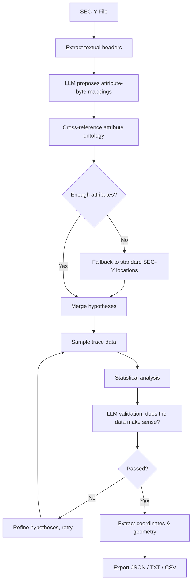

# SEGYScribe

**An LLM-assisted parser that reads SEG-Y textual headers, infers trace-header byte layouts, and validates them against real trace data.**

SEG-Y files store critical acquisition metadata — coordinates, inline/crossline
numbers, CDP locations — at byte offsets in the trace header. The SEG-Y standard
defines where these *should* live, but in practice surveys deviate constantly:
custom byte positions, vendor-specific conventions, and free-text textual headers
that describe the layout in prose. Reading them by hand is slow and error-prone.

SEGYScribe automates that work. It feeds the textual header to an LLM to propose
attribute-to-byte mappings, cross-references them against a SEG-Y attribute
ontology, samples actual trace data to check whether each proposed mapping is
plausible, and exports a structured result you can feed into downstream tooling.

## How it works



1. **Header extraction** — textual headers are read and decoded (ASCII/EBCDIC) via `segyio`.
2. **LLM analysis** — the model proposes which attributes map to which byte ranges.
3. **Ontology cross-reference** — proposals are checked against a 27-attribute SEG-Y ontology (`segy_attribute_ontology.json`).
4. **Fallback** — if too few attributes are found, standard SEG-Y locations are applied.
5. **Validation** — real trace data is sampled and statistically profiled, then the LLM judges whether each mapping is consistent with the data.
6. **Refinement** — failed hypotheses are revised and re-checked, up to a configurable number of attempts.
7. **Export** — results are written as JSON, TXT, and CSV with per-attribute confidence scores.

## Quick start

```bash
git clone https://github.com/owenloh/SEGYScribe
cd SEGYScribe
pip install -r requirements.txt

# Configure your LLM provider
cp .env.template .env
# Edit .env and set GEMINI_API_KEY (free key from https://aistudio.google.com/)

python main.py
```

`main.py` launches an interactive menu that walks you through parsing a file or
viewing its textual header. See [QUICKSTART.md](QUICKSTART.md) for a fuller setup
walkthrough.

### LLM providers

SEGYScribe supports two provider types, configured in `.env`:

- **Gemini** (`google-generativeai`) — recommended; free API key available.
- **Local** — any OpenAI-compatible chat completions endpoint (e.g. a self-hosted Llama server).

## Command-line usage

```bash
# Basic parse
python parse_segy.py survey.sgy

# Custom output directory
python parse_segy.py survey.sgy --output-dir ./results

# Processing modes
python parse_segy.py survey.sgy --config fast       # fewer checks, smaller samples
python parse_segy.py survey.sgy --config balanced   # default
python parse_segy.py survey.sgy --config accurate --verbose

# Select output formats
python parse_segy.py survey.sgy --formats json txt csv

# View a textual header without parsing
python print_textual_header.py survey.sgy

# main.py also accepts direct subcommands
python main.py parse survey.sgy
python main.py view survey.sgy
python main.py help
```

### Processing modes

The three modes trade speed for thoroughness:

| Setting | Fast | Balanced | Accurate |
|---|---|---|---|
| Validation attempts | 1 | 2 | 3 |
| Sample size (traces) | 25 | 75 | 150 |
| Chain-of-thought reasoning | ✗ | ✓ | ✓ |
| Hypothesis refinement | ✗ | ✓ | ✓ |
| Confidence threshold | 0.80 | 0.85 | 0.90 |
| Output formats | JSON | JSON + TXT | JSON + TXT + CSV |
| Verbose logging | ✗ | ✗ | ✓ |

`balanced` is the default and a good starting point. Use `fast` for quick
exploration of large files and `accurate` when correctness matters most.

### Batch processing

List one SEG-Y path per line in `segypaths.txt` and `main.py` will process them
all in a single run.

## Output

Each run writes three files to the output directory (`./output` by default):

- `*_parsing_results.json` — full structured result
- `*_parsing_results.txt` — human-readable report
- `*_parsing_summary.csv` — flat summary for spreadsheets

Example JSON:

```json
{
  "revision_info": {
    "revision": "1.0",
    "confidence": "high",
    "source": "textual_header"
  },
  "attributes": [
    {
      "attribute_name": "CDP NUMBER",
      "byte_start": 21,
      "byte_end": 24,
      "confidence": 0.95,
      "validation_status": "validated"
    }
  ],
  "geometric_info": {
    "world_coordinates": {
      "X": { "byte_start": 193, "byte_end": 196 },
      "Y": { "byte_start": 197, "byte_end": 200 }
    }
  }
}
```

## Python API

```python
from enhanced_segy_parser import SEGYHeaderParser, ParsingConfig

config = ParsingConfig(
    max_validation_attempts=3,
    enable_chain_of_thought=True,
    output_formats=["json", "txt", "csv"],
)

parser = SEGYHeaderParser(config)
result = parser.parse_segy_file("survey.sgy", "./output")

print(f"Detected {len(result.attributes)} attributes")
print(f"Confidence: {result.confidence_summary}")
```

## Project layout

```
SEGYScribe/
├── main.py                      # Interactive entry point + subcommands
├── parse_segy.py                # CLI parsing engine
├── print_textual_header.py      # Textual header viewer
├── config_system.py             # Processing-mode configuration
├── enhanced_segy_parser.py      # Top-level parser orchestration
├── segy_attribute_ontology.json # SEG-Y attribute knowledge base (27 entries)
├── core/                        # Processing modules
│   ├── llm_provider.py          # Gemini + local LLM providers
│   ├── llm_header_parser.py     # LLM-driven header analysis
│   ├── attribute_ontology.py    # Ontology loader
│   ├── trace_data_validator.py  # Validates hypotheses against trace data
│   ├── statistical_analyzer.py  # Statistical profiling of sampled data
│   ├── hypothesis_refiner.py    # Iterative refinement of failed mappings
│   ├── fallback_strategy_manager.py # Standard SEG-Y location fallbacks
│   ├── geometric_extractor.py   # Coordinate / geometry extraction
│   └── result_exporter.py       # JSON / TXT / CSV output
└── models/                      # Data structures
```

## Customizing the ontology

The attribute ontology in `segy_attribute_ontology.json` gives the LLM context
about known SEG-Y attributes, their typical byte locations, and naming variants.
Adding entries for your organization's conventions can improve accuracy on
non-standard surveys:

```json
{
  "your_custom_attribute": {
    "description": "What this attribute represents",
    "typical_bytes": [25, 28],
    "aliases": ["ALT_NAME", "VARIANT_NAME"]
  }
}
```

## Requirements

- Python 3.8+
- An LLM provider — a Gemini API key (free) or a local OpenAI-compatible endpoint
- See [requirements.txt](requirements.txt) for Python dependencies (`segyio`, `numpy`, `pandas`, `scipy`, `scikit-learn`, provider SDKs, etc.)

## Contributing

Contributions are welcome:

1. Fork the repository
2. Create a feature branch
3. Add tests for new functionality
4. Open a pull request
